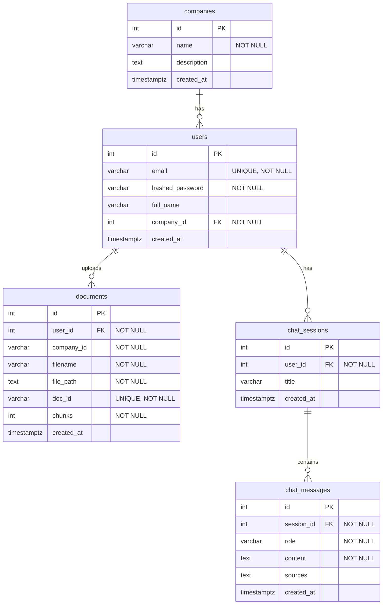

```mermaid
erDiagram
    companies ||--o{ users : "has"
    users ||--o{ documents : "uploads"
    users ||--o{ chat_sessions : "has"
    chat_sessions ||--o{ chat_messages : "contains"

    companies {
        int id PK
        varchar name "NOT NULL"
        text description
        timestamptz created_at
    }

    users {
        int id PK
        varchar email "UNIQUE, NOT NULL"
        varchar hashed_password "NOT NULL"
        varchar full_name
        int company_id FK "NOT NULL"
        timestamptz created_at
    }

    documents {
        int id PK
        int user_id FK "NOT NULL"
        varchar company_id "NOT NULL"
        varchar filename "NOT NULL"
        text file_path "NOT NULL"
        varchar doc_id "UNIQUE, NOT NULL"
        int chunks "NOT NULL"
        timestamptz created_at
    }

    chat_sessions {
        int id PK
        int user_id FK "NOT NULL"
        varchar title
        timestamptz created_at
    }

    chat_messages {
        int id PK
        int session_id FK "NOT NULL"
        varchar role "NOT NULL"
        text content "NOT NULL"
        text sources
        timestamptz created_at
    }
```
